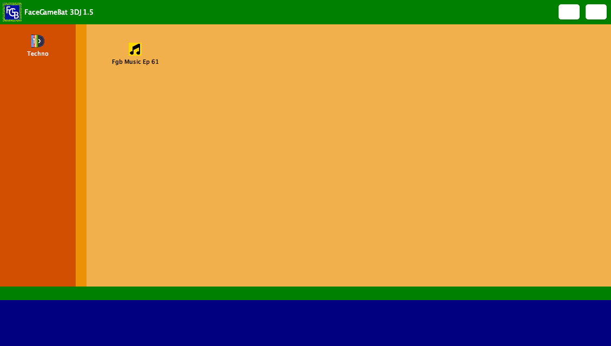

# FaceGameBat 3DJ 1.5

A small desktop **Java Swing/AWT** application — a custom-skinned, borderless launcher window
("techno" dashboard) with a built-in **MP3 player** that streams a bundled track through the
[JLayer](http://www.javazoom.net/javalayer/javalayer.html) (JavaZoom `jl`) decoding library.

> Repository name: `nri` · Application name: *FaceGameBat 3DJ 1.5*

---

<table>
  <tr>
    <td align="center">
      <br>
      <sub><em>FaceGameBat 3DJ 1.5 — the undecorated launcher window</em></sub>
    </td>
  </tr>
</table>

---

## What it does (use case)

This is a **standalone, single-user desktop GUI** — there is no networking, database, or backend.
It is essentially a themed "media launcher" demo:

1. On start it opens a **frameless (undecorated) 1130×640 window** with a hand-built title bar
   (custom logo, the title rendered as four separate labels, plus **minimize** and **close**
   buttons). Because the OS window chrome is removed, the title bar implements its own
   **click-and-drag-to-move** logic via mouse listeners.
2. A left-hand sidebar holds a **"Techno"** button that re-launches/refreshes the dashboard.
3. A **"Fgb Music Ep 61"** button opens a second window — a minimal **MP3 player** with
   **Play** / **Stop** controls that decodes and plays the bundled `FgbMusicEp61.mp3` on a
   background thread.

Typical use: a personal/portfolio "skinned app" showcase demonstrating custom Swing chrome and
embedded MP3 playback — not a production tool.

---

## Architecture

### High-level structure

```
nri/
├── FaceGameBat_3DJ_1_5.java     # Main app: the launcher window (entry point)
├── Run Console.bat             # Windows build+run script
├── Console.sh                  # macOS/Linux build+run script (zsh)
├── Logo/                       # Window icon + title-bar logo (logo-1.png, logo-2.png)
├── File_Logo/                  # Sidebar button icons (techno.png, music_file.png)
├── Music/
│   └── FgbMusicEp61_Fr/
│       ├── FgbMusicEp61.java   # MP3 player window (package Music.FgbMusicEp61_Fr)
│       └── FgbMusicEp61.mp3    # Bundled audio track (~1.6 MB)
└── javazoom/jl/                # Vendored JLayer MP3 library (.java sources + prebuilt .class)
    ├── decoder/                #   MPEG layer I/II/III frame decoding
    ├── player/                 #   Player + JavaSound audio output devices
    └── converter/              #   WAV/RIFF conversion utilities
```

### Component / layer view

```
┌────────────────────────────────────────────────────────────────┐
│  FaceGameBat_3DJ_1_5  (JFrame, entry point)                    │
│  • main() → SwingUtilities.invokeLater → techno()              │
│  • Builds undecorated window: custom title bar (drag/min/X),   │
│    sidebar panels, "Techno" + "Fgb Music Ep 61" buttons        │
│  • Layout: setLayout(null) — everything absolutely positioned  │
│            via setBounds(x,y,w,h)                              │
└───────────────────────────────┬────────────────────────────────┘
                                │ "Fgb Music Ep 61" button click
                                ▼
┌────────────────────────────────────────────────────────────────┐
│  Music.FgbMusicEp61_Fr.FgbMusicEp61  (JFrame)                  │
│  • Play  → new Thread → JLayer Player.play() on FileInputStream│
│  • Stop  → player.close() + thread.interrupt()                 │
└───────────────────────────────┬────────────────────────────────┘
                                │ uses
                                ▼
┌───────────────────────────────────────────────────────────────┐
│  javazoom.jl  (vendored JLayer library)                       │
│  player.Player ─ decoder.* (Bitstream, Header, Layer*Decoder, │
│  SynthesisFilter) ─ player.JavaSoundAudioDevice (javax.sound) │
└───────────────────────────────────────────────────────────────┘
```

### Key design notes

- **UI toolkit:** Java **Swing** (`javax.swing.*`) on top of AWT (`java.awt.*` for `Color`,
  `Point`, `Font`, event handling). Despite the "AWT stack" label, the windows are Swing
  `JFrame`s; AWT is used for low-level primitives and events.
- **Absolute layout:** every panel/label/button is positioned with `setLayout(null)` +
  `setBounds(...)`. This makes the UI pixel-fixed (no responsive resizing).
- **Custom window chrome:** `f1.setUndecorated(true)` removes the native title bar; a `JPanel`
  with `MouseListener`/`MouseMotionListener` re-implements window dragging, and custom buttons
  re-implement minimize (`setExtendedState(ICONIFIED)`) and close (`dispose()`).
- **Audio pipeline:** `FgbMusicEp61` wraps a `FileInputStream` in a JLayer `Player` and calls
  `play()` on a dedicated `Thread` so the Swing Event Dispatch Thread is never blocked; `Stop`
  closes the player and interrupts the thread.
- **Vendored dependency:** JLayer is checked into `javazoom/jl/` as both source and prebuilt
  `.class` files / `.ser` resources — there is **no build tool** (no Maven/Gradle); compilation
  is manual `javac`.
- **Imports** in the main file are deliberately listed one-class-per-line (the wildcard forms
  are left as comments) — a readability/teaching choice.

---

## Running it on this machine ✅ (verified)

This project **builds and launches successfully** on this machine.

- **Environment tested:** macOS (Darwin), `javac`/`java` **25.0.2** (Oracle GraalVM 25 LTS).
- The code uses only stable, long-lived Swing/AWT/JavaSound APIs, so a modern JDK runs it fine.
  The only compiler output is a harmless *deprecation* note from the vendored JLayer
  `AudioDeviceFactory`.
- Any **JDK 8 or newer** with desktop (non-headless) support should work.

### macOS / Linux

Use the bundled **`Console.sh`** starter (zsh) — it `cd`s to the repository root itself, so it
works from any directory:

```bash
./Console.sh
```

(If needed, make it executable first: `chmod +x Console.sh`.)

Or compile and run manually from the repository root:

```bash
# 1. Compile the MP3 player (and the vendored JLayer it depends on)
javac Music/FgbMusicEp61_Fr/FgbMusicEp61.java

# 2. Compile the main launcher
javac -cp . FaceGameBat_3DJ_1_5.java

# 3. Run (image/icon paths are resolved relative to the current directory,
#    so launch from the repository root)
java -cp . FaceGameBat_3DJ_1_5
```

### Windows

Double-click **`Run Console.bat`** (it runs the two `javac` steps and then `java`).

### Note — launch from the repository root

Image, icon, and MP3 paths are all **relative to the current working directory**, so always
launch from the **repository root** (where `FaceGameBat_3DJ_1_5.java` lives). The player resolves
the track as `Music/FgbMusicEp61_Fr/FgbMusicEp61.mp3`; running from anywhere else will leave the
icons blank and make the **Play** button log a `FileNotFoundException` (the app keeps running).

---

## Fixes applied

Four bugs in the original upload were fixed while getting it to run cleanly:

| # | Problem | Fix | Where |
|---|---------|-----|-------|
| 1 | **"Fgb Music Ep 61" button never opened the player.** It wrapped the player in another window (`musicFrame.add(music)`); since `FgbMusicEp61` is itself a `JFrame`, adding it into another `JFrame` throws `IllegalArgumentException: adding a window to a container`. The click only dumped a stack trace. | Show the `FgbMusicEp61` frame directly (`music.setLocationRelativeTo(null); music.setVisible(true);`). | `FaceGameBat_3DJ_1_5.java:468` |
| 2 | **Closing the music window killed the whole app.** The player used `setDefaultCloseOperation(EXIT_ON_CLOSE)`, terminating the entire JVM — so closing the player also closed the launcher. | Changed to `DISPOSE_ON_CLOSE`. | `Music/FgbMusicEp61_Fr/FgbMusicEp61.java:19` |
| 3 | **MP3 was never found.** Playback loaded the bare filename `"FgbMusicEp61.mp3"`, but the file lives in `Music/FgbMusicEp61_Fr/`, so **Play** threw `FileNotFoundException`. | Corrected the path to `"Music/FgbMusicEp61_Fr/FgbMusicEp61.mp3"` (resolved from the repository root). | `Music/FgbMusicEp61_Fr/FgbMusicEp61.java:28` |
| 4 | **Closing the music window left the sound playing.** With **Play** running, closing the player window (and reopening it) left the MP3 looping with no way to stop it — **Stop** only acts on the new window's player. `DISPOSE_ON_CLOSE` (Fix #2) disposes the frame but never stops the background playback thread; only the old `EXIT_ON_CLOSE` had incidentally silenced it by killing the JVM. | Intercept the window-closing event with a `WindowAdapter` and call `stopMp3()`, so closing the window stops the sound exactly like pressing **Stop**. | `Music/FgbMusicEp61_Fr/FgbMusicEp61.java` (constructor) |

---

## Requirements

- **JDK 8+** (verified on JDK 25 / GraalVM) with desktop support — i.e. **not** a headless JRE.
- A graphical environment (the app opens real windows).
- Audio output device for MP3 playback (via `javax.sound`).
- No external/network dependencies; JLayer is vendored in-tree.

---

## Fix — stop the sound when the music window is closed

**Symptom:** Press **Play** → sound plays. Press **Stop** → it stops (good). But press **Play**
and then **close the player window** (the dialog with the Play/Stop buttons) → the sound keeps
playing. Reopening the window and pressing **Stop** does **not** stop it either, because the new
window's **Stop** only closes the *new* `Player` instance — the original playback thread from the
closed window is still running and is no longer reachable.

**Cause:** `setDefaultCloseOperation(DISPOSE_ON_CLOSE)` only disposes the frame; it never stops the
background decode/playback thread (`player.close()` + `playThread.interrupt()`). The previous
`EXIT_ON_CLOSE` only "worked" by killing the whole JVM.

**Fix — intercept the window close and stop playback, just like the Stop button.** Add a
`WindowAdapter` whose `windowClosing(...)` calls the existing `stopMp3()` in the `FgbMusicEp61`
constructor (right after `setDefaultCloseOperation(...)`):

```java
import java.awt.event.WindowAdapter;
import java.awt.event.WindowEvent;

// ... inside the FgbMusicEp61() constructor, after setDefaultCloseOperation(DISPOSE_ON_CLOSE):

// Closing the window must stop playback too. DISPOSE_ON_CLOSE only
// disposes the frame; the MP3 plays on a separate background thread,
// so without this the sound keeps running after the window is gone.
// Intercept the close event and stop the sound, just like Stop.
addWindowListener(new WindowAdapter() {
    @Override
    public void windowClosing(WindowEvent e) {
        stopMp3();
    }
});
```

`stopMp3()` is the same method the **Stop** button already calls:

```java
private void stopMp3() {
    if (player != null) {
        player.close();
    }
    if (playThread != null) {
        playThread.interrupt();
    }
}
```

With this in place, closing the player window stops the audio immediately — identical to pressing
**Stop** — so no orphaned, unreachable playback thread is ever left running.
